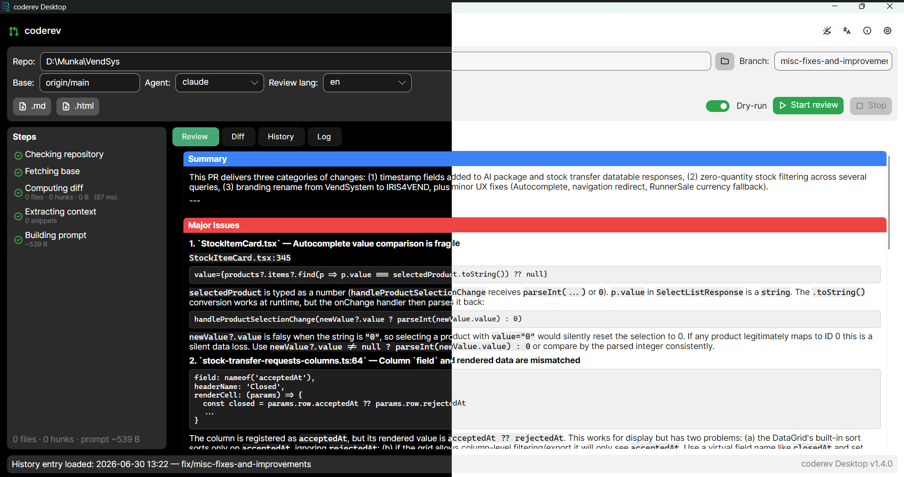
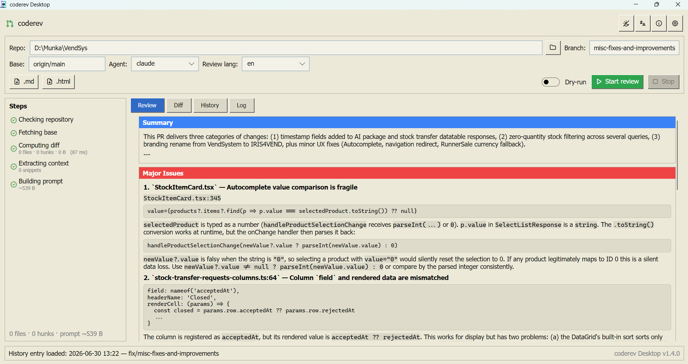

# coderev

**AI-alapú kódáttekintő (code review) eszköz** — egy git branch változásait
elküldi egy AI-ügynöknek (pl. Claude), és visszakapod strukturált, magyar
vagy angol nyelvű review-t: mi jó, mi hibás, mit érdemes még megcsinálni.
Kétféleképp használható, ugyanazzal a motorral: parancssorból (**CLI**) vagy
grafikus felületen (**Desktop GUI**).



---

## Mi ez, és kinek való?

Ha valaha manuálisan mentél végig egy pull request diffjén, tudod, hogy ez
időigényes és könnyű benne elsiklani valami fölött. A coderev ezt a lépést
automatizálja: **te csak megadod, melyik branch-et akarod áttekinteni**, a
program pedig

1. lekéri a git diffet a megadott branch és egy bázis-ág (pl. `origin/main`)
   között,
2. összeállít belőle egy jól strukturált promptot (a releváns kontextussal
   együtt),
3. átadja egy **AI-ügynöknek** (Claude Code, OpenAI Codex, GitHub Copilot
   CLI, vagy bármilyen más parancssori eszköz),
4. és a választ **élőben**, formázva, szekciókra bontva (Összegzés / Fő
   problémák / Apró problémák / Tesztek / Javaslatok) jeleníti meg.

Nem kell hozzá semmilyen programozói előismeret a coderev-hez magához —
elég tudni, melyik git branch-et szeretnéd áttekintetni, és mihez képest
(melyik a "bázis" ág). A program vezet végig a többin.

## Hogyan működik belülről?

A projekt két rétegből áll, amelyek **egy közös motort** használnak, így a
viselkedésük mindig ugyanaz:

| Réteg | Nyelv | Szerepe |
|---|---|---|
| **Motor (`coderev` CLI)** | Go | git-műveletek, a prompt összeállítása, az AI-ügynök meghívása, az eredmény kiírása. Önmagában is használható parancssorból. |
| **Desktop GUI** | .NET / Avalonia | A motort alfolyamatként indítja, és annak strukturált (NDJSON) eseményfolyamát jeleníti meg élőben: lépések, diff, streamelt AI-válasz. Nem duplikálja a logikát — csak vizuálisan mutatja meg. |

Fontos, hogy a coderev **nem módosítja a repository-t** — nincs `git
checkout`, nincs semmilyen destruktív művelet. Csak olvassa a diffet a
megadott két ref között.

## Főbb funkciók

- **Élő haladásjelzés** — a review minden lépése (repó ellenőrzés, fetch,
  diff, prompt-építés, AI-hívás) látható státusz-ikonokkal, futás közben.
- **Formázott review** — a natív markdown-megjelenítés (kódblokkok,
  listák, kiemelések) miatt a review azonnal olvasható, nem nyers szöveg.
- **Színes, sorszámozott diff-nézet**, fájllista szerinti navigálással és
  szabadon átméretezhető oszlopokkal.
- **Review-előzmények** — minden lefutott review automatikusan elmentődik
  (repository szerint szűrhető), bármikor visszatölthető és exportálható
  Markdown vagy HTML formátumba.
- **Dry-run mód** — az AI meghívása nélkül is megnézheted, pontosan mi
  kerülne bele a promptba (hasznos költség nélküli teszteléshez).
- **Legutóbbi repository-k és branch-ek** megjegyzése, egy kattintással
  újranyithatók.
- **Automatikus frissítés** — mind a GUI (⬆ gomb az appban), mind a CLI
  (`coderev update`) magától frissül a legújabb kiadásra.
- **Három megjelenés**: Világos, Sötét, és egy retró **Windows 2000/XP
  korszak**-stílusú téma (lásd lentebb).

## A retró (2000-es évek) téma

A szokásos világos/sötét mellett választható egy harmadik, játékos téma is,
amely a korai 2000-es évek Windows-alkalmazásainak (Windows 2000 / XP)
kinézetét idézi: bézs felületek, 3D "domború" gombok, szögletes sarkok,
klasszikus kék kijelölés-szín.



A téma a fejlécben található 🌓 gomb legördülő menüjéből választható
(*Világos / Sötét / Retro*), és a választás automatikusan megjegyződik a
következő indításig.

## Mire van szükséged a használatához?

| Mi kell | Mire |
|---|---|
| **`git`** a PATH-on | A repository elemzéséhez — mindig szükséges. |
| **Egy AI-ügynök CLI** (pl. a [Claude Code CLI](https://docs.anthropic.com/claude/docs/claude-code)) | Csak a **valódi** (nem dry-run) review-hoz. |
| Semmi más | A telepítés SDK-mentes — se Go, se .NET nem kell a végfelhasználónak. |

> **Tipp:** ha csak ki szeretnéd próbálni a felületet AI-hívás (és
> költség) nélkül, pipáld be a **Dry-run** kapcsolót — így a teljes
> folyamat lefut, csak az AI-válasz marad ki.

## Telepítés

A legegyszerűbb út: töltsd le a kész csomagot a
**[Releases oldalról](https://github.com/zsoltvarga23/coderev-2/releases/latest)** —
nincs szükség semmilyen fejlesztői eszközre.

```powershell
# Windows — CLI telepítése egy paranccsal
irm https://raw.githubusercontent.com/zsoltvarga23/coderev-2/main/get.ps1 | iex
```

```bash
# Linux / macOS — CLI telepítése egy paranccsal
curl -fsSL https://raw.githubusercontent.com/zsoltvarga23/coderev-2/main/get.sh | bash
```

A **Desktop GUI**-hoz (Windows/Linux) töltsd le a `CodeRev-win-Setup.exe`-t
vagy a `.AppImage` fájlt a Releases oldalról.

A telepítés és a frissítés minden részlete (kézi telepítés, forrásból
fordítás fejlesztőknek, stb.): **[INSTALL.md](INSTALL.md)**.

## Használat

### Parancssorból (CLI)

```bash
coderev <branch> [opciók]
```

Példák:

```bash
# feature/x review az origin/main ellen
coderev feature/x

# develop ellen, angol kimenettel, fájlba mentve
coderev feature/x --base-ref origin/develop --lang en --out review.md

# a prompt megtekintése AI-hívás nélkül (költségmentes teszt)
coderev feature/x --dry-run

# .coderev.json generálása a repo gyökerébe a megadott opciókkal
coderev init --agent copilot --base-ref origin/develop --out review.md

# egyedi AI-ügynök megadása
coderev feature/x --agent-config '{"cmd":["mycli","review","--in","{prompt_file}"],"mode":"file"}'

# a CLI frissítése a legújabb kiadásra
coderev update
```

A flagek a `<branch>` argumentum előtt és után is megadhatók.

### Grafikus felületen (Desktop GUI)

1. **Nyisd meg** a repository-t a 📂 gombbal (vagy válaszd a legutóbb
   használtak közül).
2. Add meg a **branch**-et és a **bázis** referenciát (pl. `origin/main`) —
   mindkettő autocomplete-tel segít.
3. Válassz **AI-ügynököt** és **nyelvet**, majd nyomd meg a zöld
   **Start review** gombot (vagy pipáld be a **Dry-run**-t egy AI nélküli
   próbafutáshoz).
4. Kövesd élőben a lépéseket, majd nézd meg a formázott review-t a
   **Review** fülön, vagy a diffet a **Diff** fülön.
5. Az elmúlt futások a **History** fülön érhetők el; egy kattintással
   visszatölthetők és exportálhatók.

## Frissítés

| Komponens | Hogyan |
|---|---|
| **GUI** | A fejlécben megjelenő ⬆ gomb — csak akkor látszik, ha van új verzió; ellenőriz, letölt, újraindul. |
| **CLI** | `coderev update` (`--check` kapcsolóval csak megnézi, van-e újabb). |

## Konfiguráció

A beállítások `.coderev.json` fájlban is rögzíthetők (repónként), így nem
kell minden futtatáskor újra megadni az agentet, a nyelvet, a bázis
referenciát, stb. Létrehozása:

```bash
coderev init --agent claude --lang hu --base-ref origin/main
```

Precedencia: **CLI flag > környezeti változó (`CODEREV_*`) > `.coderev.json`
> beépített alapérték**. A GUI-ban a **⚙ Settings** ablak ugyanezt a fájlt
szerkeszti grafikusan.

## Fejlesztőknek

```bash
# Motor (Go)
go build -o coderev ./cmd/coderev
go test ./...
go vet ./...

# Desktop GUI (.NET / Avalonia)
cd coderev-desktop
dotnet build
dotnet test src/CodeRev.Core.Tests
dotnet run --project src/CodeRev.App
```

- Repó-struktúra és tervezési döntések: [docs/03-go-ujratervezes.md](docs/03-go-ujratervezes.md)
- Desktop GUI részletek: [coderev-desktop/README.md](coderev-desktop/README.md)
- Kiadás készítése karbantartóknak: [RELEASING.md](RELEASING.md)
